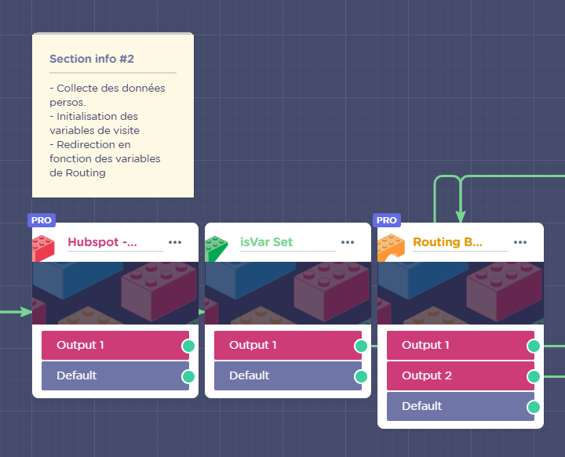
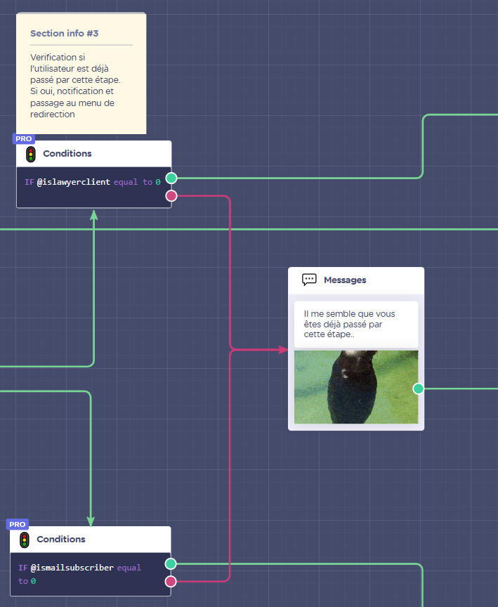

# Ajouter un service

> Suivez les étapes suivantes pour ajouter un nouveau service.

## 1 - Ajouter le service

Ajoutez les blocs qui réalisent le service dans la section 4.x de l'application.

!> Rassemblez vos blocs dans une Brick pour faciliter la lisibilité.

## 2 - Mettre à jour les menus

Ajoutez le bouton nécessaire dans les menus de la <b>Section 1</b> et dans la Brick la <b>Section 5</b>.

## 3 - Modifier la variable de Routing

La valeur de la variable <code>submission_type</code> doit prendre une valeur en relation avec le nom du service.

Elle doit être changée <b>2 fois</b>, dans la <b>Section 1</b> et dans la Brick de la <b>Section 5</b>

## 4 - Mettre à jour la Routing Brick

Une nouvelle IF condition sur la variable <code>submission_type</code> pour le nouveau service.

Un nouvel <b>Output x</b> doit être également créé dans la Routing Brick, et lié au service.

## 5 - Créer une variable <code>is_service</code> et vérifier le passage de l'utilisateur

Créez une variable <code>is_service</code> (par exemple <code>ismailsubscriber</code>) et initialisez-la à 0 dans la Brick <b>IsVarSet</b>

Dans la <b>Section 3</b>, après le Routing et avant le lancement du service, mettez une IF condition sur la variable créée.

>si égale à 0, continuez au service. si différente de 0, redirigez vers le message d'erreur.

Notez maintenant le passage de l'utilisateur dans votre service, <b>en mettant la variable à 1</b>.

