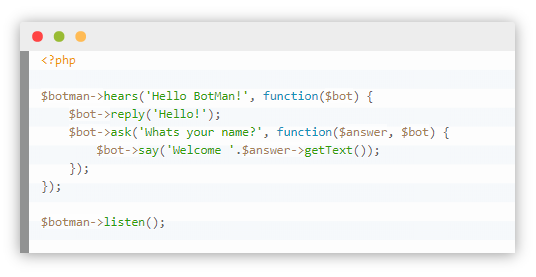
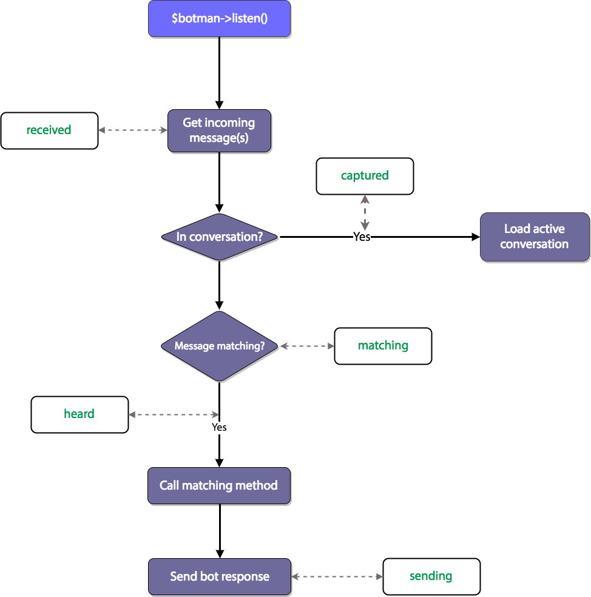
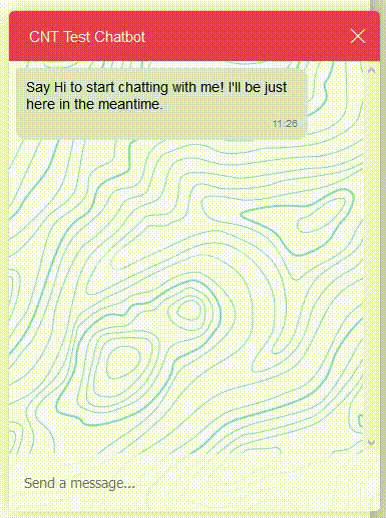

# BotMan

> Les Frameworks et les librairies gratuites sont les amis du développeur.

## Qu'est ce que c'est?

<a href="https://botman.io/">BotMan</a> est un Framework PHP de création de chatbots, gratuit et personnalisable.
BotMan est un framework PHP Chatbot conçu pour simplifier le développement de robots innovants pour plusieurs plates-formes de messagerie, notamment Slack, Telegram, Microsoft Bot Framework Nexmo, HipChat, Facebook Messenger, WeChat et bien d'autres.

## Fonctionnalités de base

À un niveau de base, un bot de discussion comprend une fonctionnalité permettant d'écouter les messages et d'y répondre. Par exemple, si vous demandez à votre bot la météo, il peut consulter la météo depuis une API et vous redonner ensuite les prévisions.

## Fonctionnalités avancées

BotMan prend également en charge des fonctionnalités avancées, telles qu'un système middleware, le traitement du langage naturel, la récupération d'informations utilisateur et le stockage.

Le système middleware a été davantage développé dans la version 2.0, ce qui vous permet de vous connecter à différentes parties du cycle de vie de ChatBot. Vous pouvez faire des choses puissantes comme garder une trace des statistiques relatives aux discussions avec réponses et fournir la PNL pour les messages entrants. Les points d'entrée disponibles pour le middleware sont les suivants: <code>sending</code>, <code>received</code> et <code>heard</code>

## Exemple réalisé

> Vous pouvez également consulter l'<a href="https://botman.io/">exemple</a> donné par BotMan.

## Plus d'infos

Pour plus d'infos, visitez le <a href="https://botman.io/">Site Web</a> de BotMan.